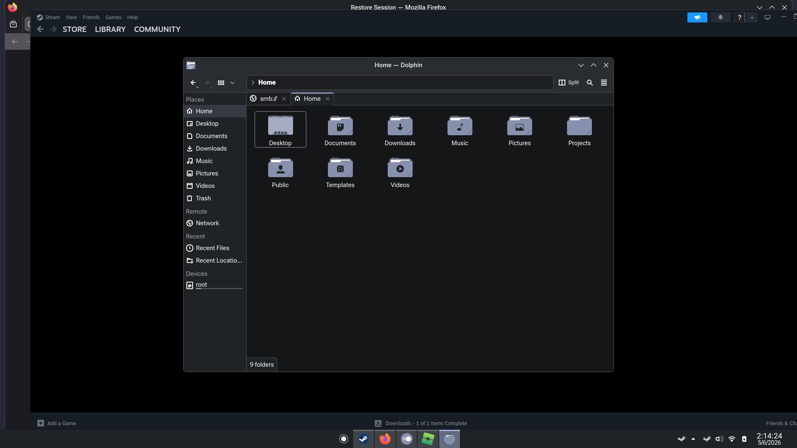

<div align="center">

# nix-config

sturq's multi-platform Nix flake — NixOS, nix-darwin, nix-on-droid, NixOS-WSL.
One repo, one `flake.lock`, every machine reproducible from `git pull`.



</div>

---

## Stack

- **Sway** (Wayland tiling compositor) — configured purely via
  `home-manager.wayland.windowManager.sway`, no C/config.h
- **Waybar** — top status bar (workspaces · title · audio · WiFi · battery · clock)
- **ReGreet** — modern GTK4 graphical greeter (runs via cage; replaced tuigreet)
- **Stylix** with the [sturq-palette](https://github.com/sturq/sturq-palette)
  OLED scheme — system-wide theming for GTK, Qt, foot, mako, firefox,
  regreet, waybar, all auto-themed from one base16 attrset
- **Wayland-native helpers** — foot (terminal, OLED-black + Tango colors),
  fuzzel (launcher), swaylock (pure-black lockscreen), grim+slurp
  (screenshots), mako (notifications), wob (volume OSD), wl-clipboard,
  swayidle, brightnessctl
- **Disko + nixos-anywhere** for declarative fresh installs from any other
  Linux box (kexec-bootstrap works on existing NixOS too)
- **TLP auto-switching** on hp250 — full `performance` governor + CPU
  boost on AC, `powersave` + ASPM `powersupersave` + WiFi pwr-mgmt on
  battery. Plus kernel-level: i915 PSR/FBC, deep S3 sleep, thermald
- **Tailscale** baked in — `sudo tailscale up` and the host joins the tailnet
- **Steam + Sober (Flatpak Roblox)** declared in `hosts/hp250/default.nix`

---

## Hosts

| Output | Use |
|---|---|
| `nixosConfigurations.hp250` | HP 250 G9 (Intel i5-1235U) — active dev laptop |
| `nixosConfigurations.vivobook` | ASUS Vivobook S 14 M5406WA (AMD Strix Point) |
| `nixosConfigurations.vm` | Proxmox test VM (auto-login) |
| `nixosConfigurations.wsl` | NixOS-WSL inside Windows |
| `nixosConfigurations.hp250-install` | Disko + nixos-anywhere variant for hp250 |
| `nixosConfigurations.vivobook-install` | Disko + nixos-anywhere variant for vivobook |
| `nixosConfigurations.vm-install` | Disko + nixos-anywhere variant for vm |
| `darwinConfigurations.macbook` | Apple Silicon (aarch64-darwin) |
| `darwinConfigurations.macbook-intel` | Intel Macs (x86_64-darwin) |
| `nixOnDroidConfigurations.phone` | Android (Termux + nix-on-droid) |

---

## Fresh install (Disko + nixos-anywhere)

Works on any Linux target (including a running NixOS — kexec is used).

```sh
nix run github:nix-community/nixos-anywhere -- \
  --flake .#hp250-install \
  root@<target-ip>
```

Disko applies the layout from `modules/disko.nix`:
1 G ESP + BTRFS root with subvolumes `@root @home @nix @snap @swap` +
zstd compression + 16 G swapfile. No LUKS.

Disk path defaults to `/dev/sda`; the per-host installer outputs in
`flake.nix` set it to the right device (`/dev/nvme0n1` for hp250 +
vivobook, `/dev/vda` for vm).

---

## Daily use

```sh
cd /etc/nixos
$EDITOR hosts/hp250/default.nix
sudo nixos-rebuild switch --flake .#hp250
git add -A && git commit -m "..." && git push

# Update inputs
nix flake update
sudo nixos-rebuild switch --flake .#hp250

# Rollback
sudo nixos-rebuild --rollback switch
# (or pick an older generation in the systemd-boot menu)
```

---

## Layout

```
flake.nix                      Composition root. Inputs + mkHost/mkInstaller/...

hosts/
  hp250/                       HP 250 G9 (active dev)
  vivobook/                    ASUS Vivobook (placeholder hardware-config)
  vm/                          Proxmox test VM
  wsl/                         NixOS-WSL
  macbook/                     nix-darwin
  phone/                       nix-on-droid

modules/                       System-level reusable modules.
  base.nix                     Boot, network, locale, user, nix settings.
  desktop/
    default.nix                programs.sway + greetd + regreet + pipewire +
                               xdg-portal-wlr + system Wayland helpers.
    autologin.nix              Optional: skip greeter, drop into Sway.
  intel-laptop.nix             Intel laptop tuning (PSR, ASPM, deep sleep, …).
  amd-laptop.nix               AMD Zen 5 tuning (asusd, amd_pstate, charge limit).
  tailscale.nix                Tailscale service.
  stylix.nix                   sturq-palette via Stylix (Bibata cursor +
                               JetBrains Mono Nerd + Inter + gradient wallpaper).
  disko.nix                    Generic BTRFS layout for mkInstaller.

home/
  sturq/                       Per-platform entry points.
    nixos.nix                  Linux: imports cli + desktop features.
    cli.nix                    CLI-only: just cli features (WSL/servers).
    darwin.nix                 macOS: cli + Mac bits.
  features/
    cli/                       Shared CLI — shell, git, ssh, direnv, tools,
                               nix-cli, claude-code. Used on every platform.
    desktop/
      default.nix              Apps: firefox, keepassxc, yazi, helix, mpv,
                               zathura, imv, pavucontrol.
      sway.nix                 Sway keybinds (Win-key MODKEY) + layout + bars=[]
                               (waybar autostarts via systemd).
      waybar.nix               Waybar — CPU/mem/disk/netspeed/audio/battery/clock.
      foot.nix                 Foot terminal — OLED-black bg + Tango ANSI palette.
      swaylock.nix             Pure-black lockscreen with sturq-palette accent.
```

---

## Keybinds (Sway, Win-key = MODKEY)

| Hotkey | Action |
|---|---|
| Win + Enter | Foot terminal |
| Win + R | fuzzel launcher |
| Win + E | yazi file manager (in foot) |
| Win + L | swaylock (Windows handles Win+L natively; same UX on both) |
| Win + Q · Alt + F4 | Close window |
| Win + Shift + Q | Exit Sway |
| Win + Tab · Alt + Tab | Focus next window |
| Win + 1..9 | Workspace 1..9 |
| Win + Shift + 1..9 | Move window to workspace |
| Win + ← / → / ↓ | Resize |
| Win + ↑ | Toggle fullscreen |
| Win + Space · Win + F | Toggle floating |
| Win + D / T / M | Layouts (split / split / tabbed) |
| Win + H/J/K | Focus left/down/up (vi-style) |
| Print | Full screenshot → `~/Pictures` |
| Shift + Print | Region screenshot → `~/Pictures` |
| Win + Shift + S | Region → clipboard (Win10-style) |
| XF86Audio* | wpctl volume / mute |
| XF86MonBrightness* | brightnessctl |

---

## What's not in the repo

- Passwords (set via `users.users.sturq.initialPassword` on first boot;
  user changes them with `passwd` afterward)
- SSH private keys, API tokens, WiFi credentials
- `hosts/hp250/hardware-configuration.nix` is committed; other hosts hold
  placeholders that get regenerated by `nixos-anywhere --generate-hardware-config`
  during fresh install

---

## Mirrors

- Windows tiling equivalent: [`sturq/win-glazewm`](https://github.com/sturq/win-glazewm)
  (GlazeWM + Zebar, same keybinds, same palette)
- Palette source: [`sturq/sturq-palette`](https://github.com/sturq/sturq-palette)

---

## Credits

- [home-manager](https://github.com/nix-community/home-manager)
- [Stylix](https://github.com/danth/stylix)
- [disko](https://github.com/nix-community/disko)
- [nixos-anywhere](https://github.com/nix-community/nixos-anywhere)
- [nix-on-droid](https://github.com/nix-community/nix-on-droid)
- [nix-darwin](https://github.com/nix-darwin/nix-darwin)
- [NixOS-WSL](https://github.com/nix-community/NixOS-WSL)
- [nix-flatpak](https://github.com/gmodena/nix-flatpak)
- [Sway](https://github.com/swaywm/sway), [Waybar](https://github.com/Alexays/Waybar), [ReGreet](https://github.com/rharish101/ReGreet)
- Structural inspiration: [Misterio77/nix-config](https://github.com/Misterio77/nix-config)
